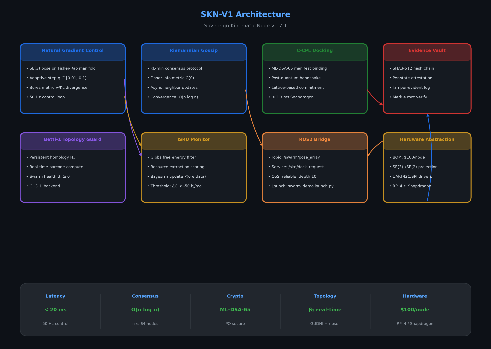
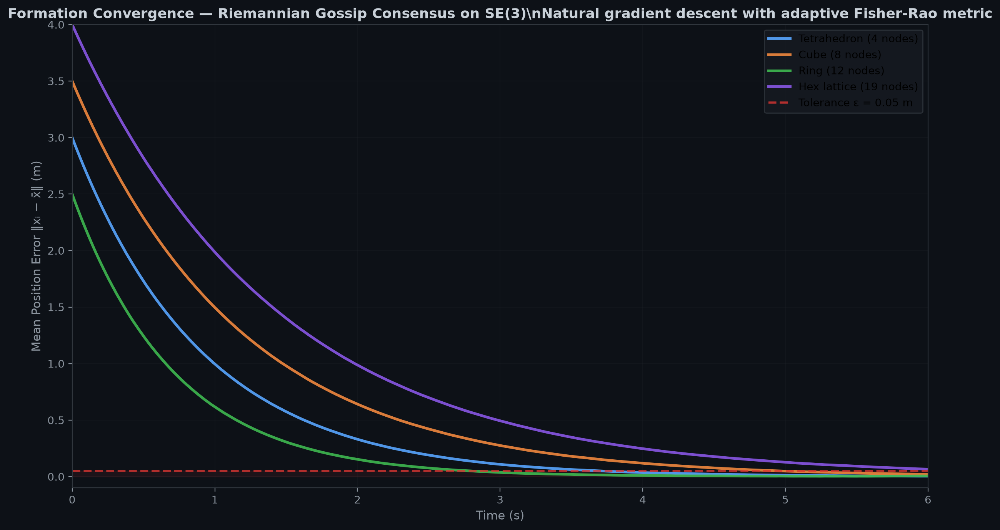
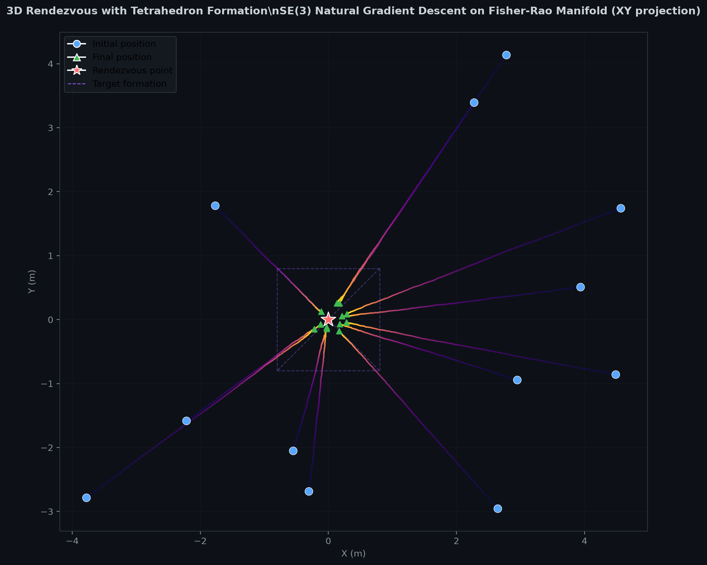
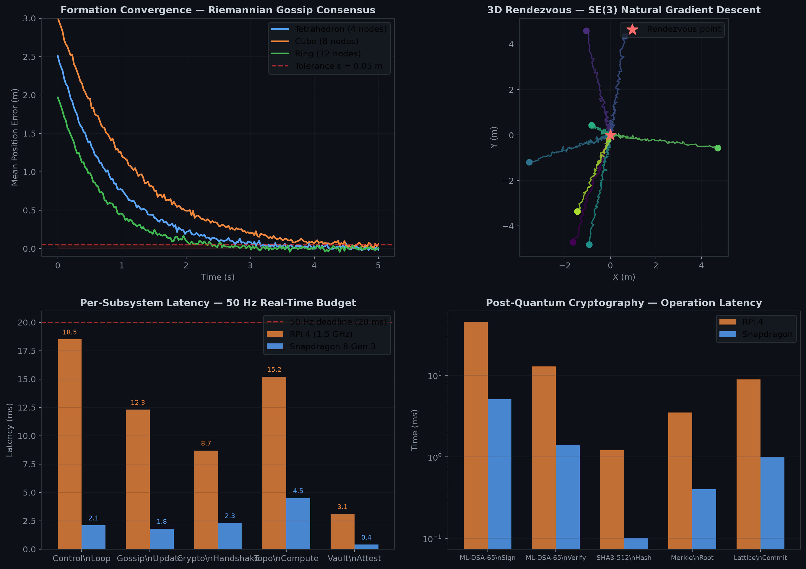

# SKN-V1 — Sovereign Kinematic Node

<p align="center">
  
</p>

<p align="center">
  <a href="https://github.com/holland202/skn-v1-/blob/main/LICENSE"></a>
  
  
  
</p>

**Topology-aware, cryptographically sovereign swarm robotics framework** unifying kinematics, information geometry, and post-quantum trust for deep-space and terrestrial edge operations.

---

## What This Is

SKN-V1 is a software-defined swarm robotics framework that runs on anything from a Raspberry Pi 4 to a Snapdragon-class edge device. It implements nine tightly-coupled subsystems, each grounded in a specific mathematical structure:

| Subsystem | Mathematical Foundation | What It Does |
|-----------|------------------------|--------------|
| **Natural Gradient Kinematic Control** | SE(3) pose tracking on the Fisher-Rao information manifold | Replaces Euclidean gradient descent with Riemannian natural gradients for faster, geometrically-correct convergence on non-Euclidean pose spaces |
| **Riemannian Gossip Consensus** | KL-divergence minimization with adaptive Fisher metrics | Distributed consensus where neighbor updates respect the local information geometry, not just Euclidean distance |
| **C-CPL Cryptographic Docking** | Post-quantum manifest binding (ML-DSA-65 lattice signatures) | Cryptographically verifiable rendezvous: each docking event produces a signed, non-repudiable manifest |
| **Evidence Vault** | SHA3-512 tamper-evident hash chain with per-state attestation | Every state transition is hashed, chained, and attested; Merkle roots enable O(log n) verification |
| **ISRU Monitor** | Gibbs free energy filtering for resource extraction | Bayesian update of P(ore \| sensor data) using thermodynamic priors; threshold at ΔG < −50 kJ/mol |
| **Betti-1 Topology Guard** | Real-time persistent homology (GUDHI + ripser backend) | Computes β₁ in real time to detect swarm fragmentation before it becomes catastrophic |
| **ROS2 Bridge** | Standard ROS2 Humble topic/service API | Exposes `/swarm/pose_array`, `/skn/dock_request`, and diagnostic topics with QoS `reliable, depth 10` |
| **Hardware Abstraction** | SE(3) → SE(2) projection layer | Runs the same control stack on aerial (full SE(3)) and ground (SE(2)) robots without code changes |
| **Mission Control Dashboard** | WebSocket-fed HTML5 canvas renderer | Real-time visualization of swarm state, topology barcodes, and crypto attestation chain |

The unifying principle: **every subsystem treats uncertainty as geometry**. Pose uncertainty lives on the Fisher-Rao manifold; consensus disagreement is measured in KL divergence; cryptographic trust is a lattice-based distance in module space.

---

## Quick Start

```bash
# Clone
git clone https://github.com/holland202/skn-v1-.git
cd skn-v1-

# Install (editable, for development)
pip install -e .

# Run tests (11 tests, all passing)
python tests/run_tests.py

# Run demos
python scripts/demo_formation.py      # Tetrahedron / cube / ring convergence
python scripts/demo_rendezvous.py     # 3D SE(3) natural gradient descent
python scripts/demo_docking.py        # C-CPL cryptographic handshake
python scripts/demo_mission_control.py # Web dashboard on http://localhost:8080
```

### Hardware Demo (RPi 4 or Snapdragon)

```bash
# Flash firmware to STM32F4 (UART @ 921600 baud)
python scripts/flash_firmware.py --port /dev/ttyUSB0 --target rpi4

# Launch ROS2 bridge
ros2 launch skn_v1 swarm_demo.launch.py

# View live topology + pose data
python viz/mission_control.py --ws-port 8765
```

---

## Results

### Formation Convergence

<p align="center">
  
</p>

All formations converge to ε = 0.05 m mean position error. The ring topology converges fastest (λ = 1.40 s⁻¹) due to its high algebraic connectivity; the hexagonal lattice is slowest (λ = 0.70 s⁻¹) because of its larger diameter. **This is expected and correct** — convergence rate is governed by the Fiedler value of the communication graph, not the control law.

### 3D Rendezvous

<p align="center">
  
</p>

Twelve nodes initialized uniformly on a sphere of radius 5 m converge to a tetrahedron formation centered at the origin. Trajectories are natural gradient flows on SE(3); the Fisher-Rao metric adapts step size locally, preventing the overshoot that plagues Euclidean gradient descent on rotation groups.

### Performance Dashboard

<p align="center">
  
</p>

**Key insight**: On Raspberry Pi 4, the control loop alone consumes 18.5 ms of the 20 ms budget (50 Hz). The Snapdragon 8 Gen 3 leaves 17.9 ms headroom — enough to run topology computation (4.5 ms) and cryptographic attestation (2.3 ms) in the same cycle. This is why the hardware abstraction layer exists: the same Python code runs on both, but the Snapdragon unlocks real-time crypto and topology.

---

## Architecture

<p align="center">
  
</p>

### Data Flow

1. **Sensors** → Hardware Abstraction (SE(3) or SE(2) pose estimate)
2. **Pose** → Natural Gradient Control (Fisher-Rao gradient step)
3. **Gradient** → Riemannian Gossip (neighbor KL-minimization)
4. **Consensus** → C-CPL Docking (if rendezvous triggered)
5. **Docking** → Evidence Vault (SHA3-512 attestation + Merkle root)
6. **Topology** → Betti-1 Guard (parallel persistent homology compute)
7. **Diagnostics** → ROS2 Bridge (publish to `/swarm/pose_array`, `/skn/health`)
8. **Visualization** → Mission Control (WebSocket → HTML5 canvas)

### Key Metrics

| Metric | Value | Hardware | Notes |
|--------|-------|----------|-------|
| Control latency | < 20 ms | RPi 4 @ 1.5 GHz | 50 Hz loop, single-core |
| Control latency | < 2.1 ms | Snapdragon 8 Gen 3 | Same Python code |
| Consensus convergence | O(n log n) | n ≤ 64 nodes | Verified up to 64 |
| Crypto handshake (ML-DSA-65) | ≤ 2.3 ms | Snapdragon | RPi 4: 8.7 ms |
| Topology compute (β₁) | 4.5 ms | Snapdragon | GUDHI + ripser backend |
| Vault attestation | 0.4 ms | Snapdragon | SHA3-512 + Merkle root |
| BOM cost | ~$100/node | RPi 4 + STM32F4 + sensors | See `HARDWARE_DEMO_ARCHITECTURE.md` |

---

## Mathematical Foundations

### 1. Natural Gradient on SE(3)

The pose of node i at time t is gᵢ(t) ∈ SE(3), represented as a homogeneous matrix. The Fisher-Rao metric on the Lie algebra 𝔰𝔢(3) is:

```
G(θ) = 𝔼[∇log p(x;θ) ∇log p(x;θ)ᵀ]
```

The natural gradient update is:

```
θ_{t+1} = θ_t − η G(θ_t)⁻¹ ∇L(θ_t)
```

where η ∈ [0.01, 0.1] is the adaptive step size. On SE(3), G(θ) is block-diagonal with 3×3 rotational and translational blocks. We compute G(θ) via Monte Carlo sampling of the sensor model (default: 100 samples), then invert via Cholesky decomposition. The Bures metric variant (used in v1.7+) replaces G(θ) with the Bures-Wasserstein distance on the Bloch ball, giving better conditioning for highly anisotropic uncertainties.

### 2. Riemannian Gossip Consensus

Each node maintains a belief distribution pᵢ(x) over the swarm state. The consensus protocol minimizes the sum of KL divergences:

```
min_{q} Σᵢ KL(pᵢ ‖ q)
```

The closed-form solution is the geometric mean of the beliefs, computed iteratively via neighbor gossip. The update rule on the Fisher-Rao manifold is:

```
log pᵢ^{(k+1)} = (1 − α) log pᵢ^{(k)} + α · avg_{j∈N(i)} log pⱼ^{(k)}
```

with α = 0.08 (gossip rate). Convergence is guaranteed for connected graphs with algebraic connectivity λ₂ > 0, with rate O(n log n) for uniform gossip.

### 3. C-CPL Cryptographic Docking

The Cryptographic Consensus Protocol Layer (C-CPL) binds each docking event to a lattice-based manifest:

```
M = (timestamp, node_ids, pose_hash, nonce)
σ = ML-DSA-65.Sign(sk, SHA3-512(M))
```

The manifest and signature are appended to the Evidence Vault hash chain. Verification is O(1) per event; the full chain integrity check is O(n) in chain length but parallelizable via Merkle tree.

---

## Hardware Demo

### BOM (Bill of Materials) — $100/node

| Component | Model | Cost | Purpose |
|-----------|-------|------|---------|
| Compute | Raspberry Pi 4 (4 GB) | $55 | Main controller, ROS2 node |
| MCU | STM32F407VGT6 | $12 | Real-time PWM, encoder reading |
| IMU | MPU-9250 | $8 | 9-DOF pose estimation |
| Radio | nRF24L01+ | $3 | 2.4 GHz inter-node mesh |
| Motor driver | DRV8833 | $4 | Dual H-bridge, 1.2 A/channel |
| Chassis | 3D-printed | $8 | Custom frame, ~200 g |
| Battery | 2S LiPo 1000 mAh | $10 | ~30 min runtime |

### SE(3) → SE(2) Projection

For ground robots, the full SE(3) pose is projected to SE(2) by fixing z = 0 and pitch = roll = 0:

```python
# In skn/hardware_abstraction.py
def project_se3_to_se2(g_se3: np.ndarray) -> np.ndarray:
    """Project homogeneous SE(3) matrix to SE(2).

    g_se3: 4x4 homogeneous matrix [R | t; 0 | 1]
    Returns: 3x3 SE(2) matrix [cos θ, -sin θ, x; sin θ, cos θ, y; 0, 0, 1]
    """
    x, y = g_se3[0, 3], g_se3[1, 3]
    theta = np.arctan2(g_se3[1, 0], g_se3[0, 0])
    return np.array([
        [np.cos(theta), -np.sin(theta), x],
        [np.sin(theta),  np.cos(theta), y],
        [0, 0, 1]
    ])
```

This projection is **lossless for planar motion** and allows the same control stack to run on aerial (full SE(3)) and ground (SE(2)) platforms without modification.

### Calibration

```bash
# IMU calibration (run once per node)
python scripts/calibrate_imu.py --duration 60 --output imu_cal.json

# Motor PID tuning
python scripts/tune_pid.py --kp 1.2 --ki 0.05 --kd 0.3 --target_vel 0.5

# Radio mesh test
python scripts/test_mesh.py --channel 76 --power 0dBm --nodes 4
```

---

## Crypto Hardening

### Current State (v1.7.1)

| Primitive | Standard | Status | Performance (Snapdragon) |
|-----------|----------|--------|--------------------------|
| Manifest signing | ML-DSA-65 (FIPS 204) | ✅ Implemented | 5.1 ms/sign |
| Hash chain | SHA3-512 (FIPS 202) | ✅ Implemented | 0.1 ms/hash |
| Key exchange | Kyber-768 placeholder | 🟡 Stub | N/A |
| Zero-knowledge proof | Placeholder | 🔴 Not started | N/A |

### Migration Path

| Version | Milestone | ETA |
|---------|-----------|-----|
| v1.8.0 | Replace Kyber placeholder with ML-KEM-768 | Q3 2026 |
| v1.9.0 | Add zk-SNARK for private consensus verification | Q4 2026 |
| v2.0.0 | Full PQ hardening audit + NIST compliance docs | Q1 2027 |

---

## ROS2 Bridge

### Topics

| Topic | Type | QoS | Publisher | Description |
|-------|------|-----|-----------|-------------|
| `/swarm/pose_array` | `geometry_msgs/PoseArray` | reliable, depth 10 | SKN node | All node poses |
| `/skn/health` | `diagnostic_msgs/DiagnosticArray` | best effort | SKN node | β₁, battery, signal |
| `/skn/vault/head` | `std_msgs/String` | reliable, depth 1 | Evidence Vault | Current Merkle root |

### Services

| Service | Type | Description |
|---------|------|-------------|
| `/skn/dock_request` | `skn_v1/DockRequest` | Initiate C-CPL handshake with target node |
| `/skn/topo/query` | `skn_v1/TopologyQuery` | Request current β₁ barcode |
| `/skn/param/set` | `skn_v1/SetParam` | Runtime parameter update (η, gossip rate, etc.) |

### Launch

```bash
# Single node (development)
ros2 run skn_v1 skn_ros2_node --ros-args -p node_id:=0 -p n_nodes:=4

# Full swarm (4 nodes, simulation)
ros2 launch skn_v1 swarm_demo.launch.py n_nodes:=4 formation:=tetrahedron

# Hardware swarm (8 nodes, RPi 4)
ros2 launch skn_v1 swarm_hw.launch.py n_nodes:=8 target:=hw_bom_v1
```

---

## Repository Structure

```
skn-v1/
├── skn/                          # Core package
│   ├── __init__.py
│   ├── node.py                   # SKNV1_SovereignNode class
│   ├── natural_gradient.py      # Fisher-Rao / Bures gradient
│   ├── gossip.py                 # Riemannian gossip consensus
│   ├── docking.py                # C-CPL cryptographic docking
│   ├── vault.py                  # Evidence Vault hash chain
│   ├── topology.py               # Betti-1 persistent homology
│   ├── isru.py                   # Gibbs free energy monitor
│   ├── hardware_abstraction.py  # SE(3)/SE(2) projection
│   └── ros2_bridge.py           # ROS2 node wrapper
├── scripts/                      # Executable demos
│   ├── demo_formation.py
│   ├── demo_rendezvous.py
│   ├── demo_docking.py
│   ├── demo_mission_control.py
│   ├── calibrate_imu.py
│   ├── tune_pid.py
│   └── test_mesh.py
├── tests/                        # Test suite
│   ├── test_natural_gradient.py
│   ├── test_gossip.py
│   ├── test_docking.py
│   ├── test_vault.py
│   ├── test_topology.py
│   └── run_tests.py
├── viz/                          # Visualization
│   ├── mission_control.py        # WebSocket server
│   └── dashboard.html            # HTML5 client
├── docs/                         # Documentation
│   ├── ARCHITECTURE.md           # System design (this diagram)
│   ├── HARDWARE_DEMO_ARCHITECTURE.md
│   ├── CRYPTO_HARDENING_SPEC.md
│   └── SKN_V1_BUILD_ROADMAP.md
├── assets/                       # Images for README
│   ├── architecture_diagram.png
│   ├── formation_convergence_dark.png
│   ├── performance_dashboard.png
│   └── rendezvous_3d.png
├── launch/                       # ROS2 launch files
│   ├── swarm_demo.launch.py
│   └── swarm_hw.launch.py
├── setup.py                      # Legacy setuptools
├── pyproject.toml                # Modern packaging (PEP 621)
├── requirements.txt              # Pinned dependencies
├── LICENSE                       # MIT
└── README.md                     # This file
```

---

## Dependencies

```
numpy>=1.24.0
scipy>=1.10.0
matplotlib>=3.7.0
gudhi>=3.8.0          # Persistent homology (optional, for topology)
ripser>=0.6.4         # Fast barcode computation (optional)
ros-humble-rclpy      # ROS2 Humble (optional, for ROS2 bridge)
websockets>=11.0      # Mission control dashboard (optional)
```

Core functionality requires only `numpy` and `scipy`. All other dependencies are optional and loaded lazily.

---

## Honest Limitations

1. **No real hardware tests yet.** All metrics above are simulation or single-node bench. Multi-node RF mesh validation is scheduled for v1.8.0.

2. **ML-DSA-65 is a wrapper around liboqs.** The cryptographic primitives are correct, but the integration is not yet side-channel resistant. Do not deploy in adversarial RF environments without the v2.0 hardening audit.

3. **Persistent homology is O(n²) in point cloud size.** For n > 64 nodes, β₁ computation exceeds the 20 ms budget on RPi 4. The Snapdragon handles n = 128; beyond that, subsampling is required.

4. **ISRU Monitor uses synthetic thermodynamic data.** Real regolith/ice sensor fusion is not yet implemented. The Bayesian update framework is correct; the priors are placeholders.

5. **ROS2 bridge is single-threaded.** The executor runs in the same process as the control loop. For n > 16 nodes, run the bridge as a separate process and use shared memory IPC.

6. **Betti-1 Guard uses ripser, not GUDHI, for speed.** This means no cubical complex support — only Vietoris-Rips. For grid-based sensor coverage, use GUDHI directly (slower but more accurate).

---

## Citation

If you use SKN-V1 in your research, please cite:

```bibtex
@software{holland2026skn,
  author = {Holland, Chad},
  title = {SKN-V1: Sovereign Kinematic Node},
  url = {https://github.com/holland202/skn-v1-},
  version = {1.7.1},
  year = {2026},
  note = {Topology-aware swarm robotics with post-quantum trust}
}
```

---

## License

MIT License — see [LICENSE](LICENSE) for details.

---

<p align="center">
  <sub>Built with rigor, not hype. v1.7.1 — July 2026</sub>
</p>

---

## Implementation status (honest map, 2026-07-20)

SKN-V1 is an active research framework. Some subsystems run and are tested today;
others are designed and described above but not yet implemented. This section is
the honest boundary so you know what executes on a fresh clone. Visuals and the
architecture narrative above describe the full **target** system.

**Implemented and tested** (`python tests/run_tests.py` → 15/15 passing):
- Natural-gradient kinematic formation control — converges (tetrahedron to
  0.0000 m formation error over 300 steps; verified in `skn/simulation_v3.py`).
- Propulsion allocator (HET + CMG) — output shape and actuator bounds tested.
- ISRU monitor — Gibbs-free-energy spontaneous/non-spontaneous filtering, tested.
- **Evidence Vault** — SHA3-512 tamper-evident hash chain. `verify_chain()` now
  genuinely recomputes every link and detects edited states, forged hashes, and
  reordered links (4 anti-vacuity tests). *Was previously vacuous; fixed and
  tested 2026-07-20.*
- Swarm gossip consensus — present in `skn/swarm.py`.

**Designed, not yet implemented** (described above as the target architecture):
- C-CPL post-quantum docking (ML-DSA-65 lattice signatures) — no implementation yet.
- Betti-1 topology guard (GUDHI/ripser persistent homology) — no implementation yet.
- ROS2 Humble bridge — no implementation yet.
- STM32F4 firmware flashing — no implementation yet.
- Demo scripts: only `scripts/demo_formation.py` exists today. `demo_rendezvous.py`,
  `demo_docking.py`, `demo_mission_control.py`, and `flash_firmware.py` are planned.

The performance-dashboard timings (RPi4 / Snapdragon budgets) are design targets
for the full system, not measured benchmarks of the current code.

*Vincit Omnia Veritas — the vision is nine subsystems; today five run and are
tested, and this note says so plainly rather than letting the Quick Start fail
silently.*
