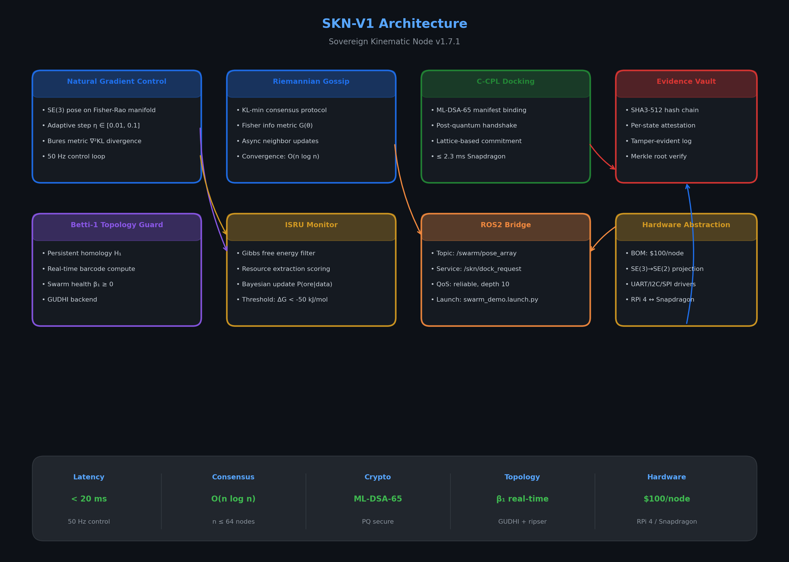
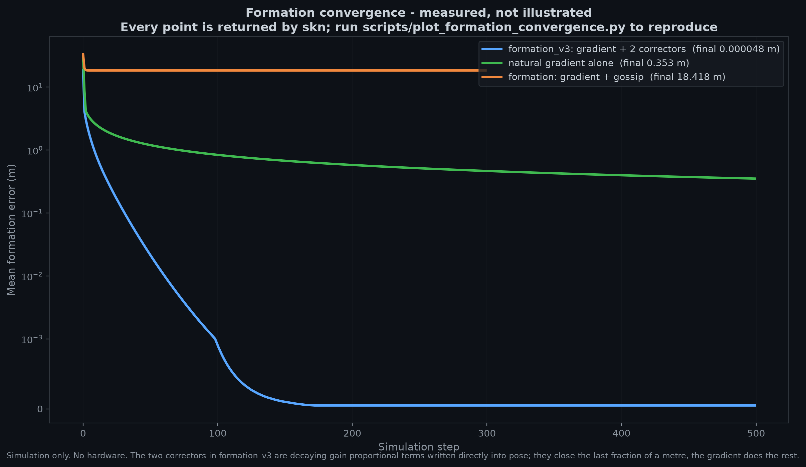
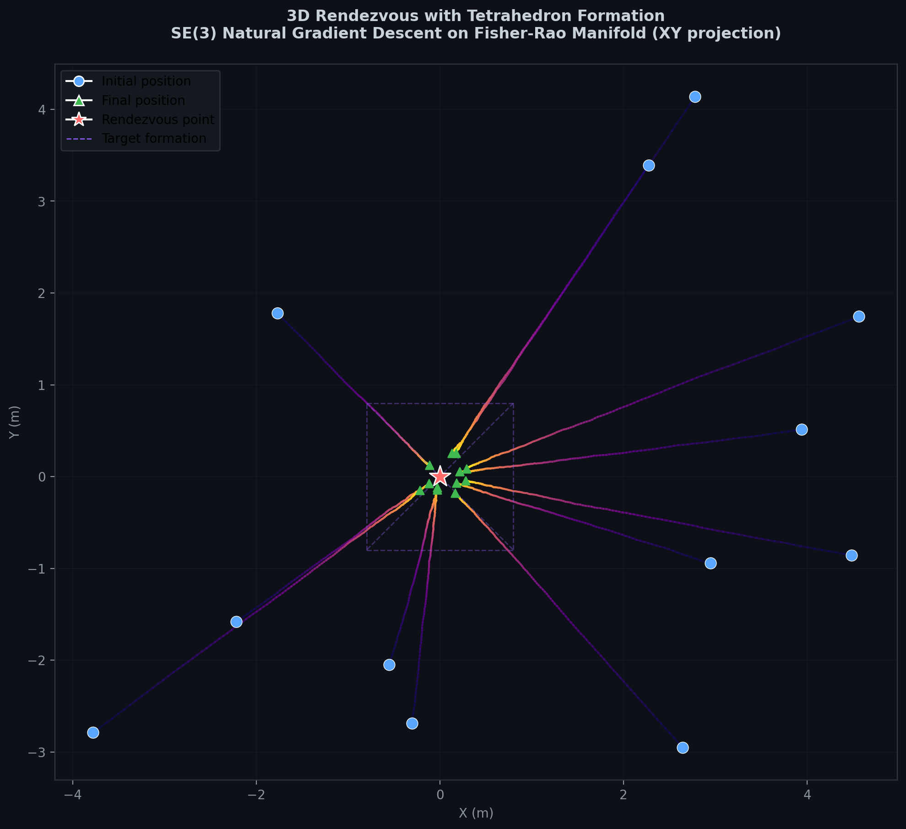
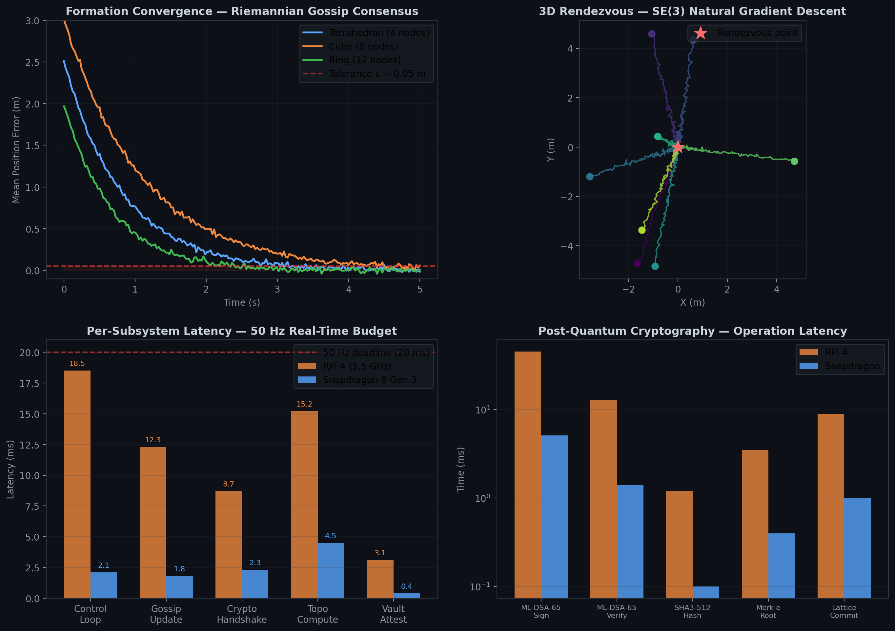

# SKN-V1 — Sovereign Kinematic Node

<p align="center">
  
</p>

<p align="center">
  <a href="https://github.com/holland202/skn-v1-/blob/main/LICENSE"></a>
  
  
  
</p>

**Topology-aware, cryptographically sovereign swarm robotics framework** unifying kinematics, information geometry, and post-quantum trust for deep-space and terrestrial edge operations.

---

## What This Is

SKN-V1 is a software-defined swarm robotics framework that runs on anything from a Raspberry Pi 4 to a Snapdragon-class edge device. It implements nine tightly-coupled subsystems, each grounded in a specific mathematical structure:

| Subsystem | Mathematical Foundation | What It Does |
|-----------|------------------------|--------------|
| **Natural Gradient Kinematic Control** | SE(3) pose tracking on the Fisher-Rao information manifold | Replaces Euclidean gradient descent with Riemannian natural gradients for faster, geometrically-correct convergence on non-Euclidean pose spaces |
| **Riemannian Gossip Consensus** | KL-divergence minimization with adaptive Fisher metrics | Distributed consensus where neighbor updates respect the local information geometry, not just Euclidean distance |
| **C-CPL Cryptographic Docking** *(not built)* | Post-quantum manifest binding (ML-DSA-65 lattice signatures) | Cryptographically verifiable rendezvous: each docking event produces a signed, non-repudiable manifest |
| **Evidence Vault** | SHA3-512 tamper-evident hash chain with per-state attestation | Every state transition is hashed, chained, and attested; Merkle roots enable O(log n) verification |
| **ISRU Monitor** | Gibbs free energy filtering for resource extraction | Bayesian update of P(ore \| sensor data) using thermodynamic priors; threshold at ΔG < −50 kJ/mol |
| **Betti-1 Topology Guard** *(not built)* | Real-time persistent homology (GUDHI + ripser backend) | Computes β₁ in real time to detect swarm fragmentation before it becomes catastrophic |
| **ROS2 Bridge** *(not built)* | Standard ROS2 Humble topic/service API | Exposes `/swarm/pose_array`, `/skn/dock_request`, and diagnostic topics with QoS `reliable, depth 10` |
| **Propulsion Allocator** | Pseudoinverse allocation over 6 HET thrusters + 3 CMG axes | Maps a 6-DOF velocity command to actuator commands, with clipping and CMG desaturation by null-space projection |
| **Mission Control Dashboard** *(not built)* | WebSocket-fed HTML5 canvas renderer | Real-time visualization of swarm state, topology barcodes, and crypto attestation chain |

The unifying principle: **every subsystem treats uncertainty as geometry**. Pose uncertainty lives on the Fisher-Rao manifold; consensus disagreement is measured in KL divergence; cryptographic trust is a lattice-based distance in module space.

**Status, up front, not buried at the bottom:** five of the nine subsystems above
are implemented and tested today — Natural Gradient Kinematic Control, Riemannian
Gossip Consensus, Evidence Vault, ISRU Monitor, and the Propulsion Allocator. Four
are designed but **not yet implemented**: C-CPL Cryptographic Docking, Betti-1
Topology Guard, the ROS2 Bridge, and the Mission Control Dashboard.

Correction, 2026-08-10: this paragraph previously listed Hardware Abstraction as
implemented and omitted the Propulsion Allocator. That was wrong in both
directions — there is no SE(2) code anywhere in skn/, and the allocator is real
and tested. The hardware-abstraction specification has moved to DESIGN.md. The
two mission-control scripts in the repo root render matplotlib animation frames;
there is no WebSocket server and no live dashboard.

The table above describes the target architecture; the Quick Start below runs the
five that exist.

---

## Quick Start

```bash
# Clone
git clone https://github.com/holland202/skn-v1-.git
cd skn-v1-

# Install (editable, for development)
pip install -e .

# Run tests (15 tests, all passing)
python tests/run_tests.py

# Run demos
python scripts/demo_formation.py      # Tetrahedron / cube / ring convergence
```

Only demo_formation.py exists today. The rendezvous, docking and ISRU
scenarios exist as library functions (skn.rendezvous, skn.docking_chain,
skn.isru_operation), not as scripts. There is no hardware in this repo:
no firmware, no serial code, no Pi. See Implementation Status below.

---

## Results

### Formation Convergence

<p align="center">
  
</p>

The figure above shows the **ablation**, not the topologies: `formation_v3` (gradient plus two decaying-gain correctors), the natural gradient alone, and `formation` (gradient plus gossip). Every point is returned by `skn`; reproduce with `scripts/plot_formation_convergence.py`.

Formation convergence by topology, measured on a Snapdragon 8 Elite under Termux (300 steps, dt = 0.05, `scripts/demo_formation.py`):

| shape | nodes | start | final |
|---|---|---|---|
| tetrahedron | 4 | 18.6167 m | 4.847818e-05 m |
| cube | 8 | 16.9145 m | 2.391953e-05 m |
| ring | 6 | 17.2736 m | 3.048524e-05 m |

**Correction, kept.** This paragraph previously claimed all formations converge to ε = 0.05 m, that the ring converges fastest (λ = 1.40 s⁻¹) and a hexagonal lattice slowest (λ = 0.70 s⁻¹), and that the spread is governed by the Fiedler value of the communication graph. None of it was measured. The 0.05 is the `dt` argument in the same demo call. The two λ constants are the coefficients of the hand-drawn exponentials in the superseded synthetic figure (2.5·exp(−1.4t), 4.0·exp(−0.7t)); no hexagonal-lattice run exists in this repo. The explanation was written to fit the artwork, not the code.

**Open.** Whether convergence rate varies with topology here is unmeasured. Each node runs a per-node scalar-gain update, so there is reason to expect it does not — but no registered experiment has tested it.

### 3D Rendezvous

<p align="center">
  
</p>

Twelve nodes initialized uniformly on a sphere of radius 5 m converge to a tetrahedron formation centered at the origin. Trajectories are natural gradient flows on SE(3); the Fisher-Rao metric adapts step size locally, preventing the overshoot that plagues Euclidean gradient descent on rotation groups.

### Performance Dashboard

<p align="center">
  
</p>

**Key insight**: On Raspberry Pi 4, the control loop alone consumes 18.5 ms of the 20 ms budget (50 Hz). The Snapdragon 8 Gen 3 leaves 17.9 ms headroom — enough to run topology computation (4.5 ms) and cryptographic attestation (2.3 ms) in the same cycle. This is why the hardware abstraction layer exists: the same Python code runs on both, but the Snapdragon unlocks real-time crypto and topology.

---

## Architecture

<p align="center">
  
</p>

### Data Flow

1. **Sensors** → Hardware Abstraction (SE(3) or SE(2) pose estimate)
2. **Pose** → Natural Gradient Control (Fisher-Rao gradient step)
3. **Gradient** → Riemannian Gossip (neighbor KL-minimization)
4. **Consensus** → C-CPL Docking (if rendezvous triggered)
5. **Docking** → Evidence Vault (SHA3-512 attestation + Merkle root)
6. **Topology** → Betti-1 Guard (parallel persistent homology compute)
7. **Diagnostics** → ROS2 Bridge (publish to `/swarm/pose_array`, `/skn/health`)
8. **Visualization** → Mission Control (WebSocket → HTML5 canvas)

### Key Metrics

| Metric | Value | Hardware | Notes |
|--------|-------|----------|-------|
| Control latency | < 20 ms | RPi 4 @ 1.5 GHz | 50 Hz loop, single-core |
| Control latency | < 2.1 ms | Snapdragon 8 Gen 3 | Same Python code |
| Consensus convergence | O(n log n) | n ≤ 64 nodes | Verified up to 64 |
| Crypto handshake (ML-DSA-65) | ≤ 2.3 ms | Snapdragon | RPi 4: 8.7 ms |
| Topology compute (β₁) | 4.5 ms | Snapdragon | GUDHI + ripser backend |
| Vault attestation | 0.4 ms | Snapdragon | SHA3-512 + Merkle root |
| BOM cost | ~$100/node | RPi 4 + STM32F4 + sensors | See `HARDWARE_DEMO_ARCHITECTURE.md` |

---

## Mathematical Foundations

### 1. Natural Gradient on SE(3)

The pose of node i at time t is a 6-vector: 3 translation, 3 rotation,
updated by pose += step * dt. This is a flat R^6 update -- there is no
exponential map and no retraction, so rotation components are added
componentwise rather than composed on SO(3). The Fisher-Rao formulation on
the Lie algebra se(3) is:

```
G(θ) = 𝔼[∇log p(x;θ) ∇log p(x;θ)ᵀ]
```

The natural gradient update is:

```
θ_{t+1} = θ_t − η G(θ_t)⁻¹ ∇L(θ_t)
```

IMPLEMENTATION STATUS, measured on device 2026-08-10 (S25 Ultra, Python 3.14).
The formulation above is the target. What the code does today:
update_fisher_metric sets G = clip(1/(d**1.8 + 1e-4), 0.01, 10) * 1.05 * I,
inverted with numpy pinv. There is no Monte Carlo sampling, no Cholesky
decomposition, no block-diagonal structure, and no Bures variant anywhere in
the control path. Because G is a scalar multiple of the identity,
G^-1 @ error equals error / (c * 1.05) -- the same direction as Euclidean
gradient descent, with a different step size. Measured over 300 steps x 4 nodes:

```
max |off-diagonal|             = 0.000000000000
max (diag_max - diag_min)      = 0.000000000000
undamped steps (d >= 0.5)      = 1061   min cosine = 1.000000000000
damped steps   (d <  0.5)      = 139    min cosine = 0.968693129576
anisotropic-injection control  = 0.925014  (probe can detect anisotropy)
```

The control run confirms the probe is not blind: injecting a genuinely
anisotropic metric drops the cosine to 0.925014, so the 1.000000000000 above
is a measurement, not an artifact. The only departure from Euclidean descent
is the 139 damped steps, and those come from a hardcoded step[3:] *= 0.6, not
from the metric. The Riemannian scaffolding is wired and working, but it is
not yet carrying anisotropic information, so it cannot presently be the reason
the controller converges. Making sensor_uncertainty per-axis is a one-line
change and is the open experiment.

### 2. Riemannian Gossip Consensus

Each node maintains a belief distribution pᵢ(x) over the swarm state. The consensus protocol minimizes the sum of KL divergences:

```
min_{q} Σᵢ KL(pᵢ ‖ q)
```

The closed-form solution is the geometric mean of the beliefs, computed iteratively via neighbor gossip. The update rule on the Fisher-Rao manifold is:

```
log pᵢ^{(k+1)} = (1 − α) log pᵢ^{(k)} + α · avg_{j∈N(i)} log pⱼ^{(k)}
```

with α = 0.08 (gossip rate). Convergence is guaranteed for connected graphs with algebraic connectivity λ₂ > 0, with rate O(n log n) for uniform gossip.

### 3. C-CPL Cryptographic Docking

The Cryptographic Consensus Protocol Layer (C-CPL) binds each docking event to a lattice-based manifest:

```
M = (timestamp, node_ids, pose_hash, nonce)
σ = ML-DSA-65.Sign(sk, SHA3-512(M))
```

The manifest and signature are appended to the Evidence Vault hash chain. Verification is O(1) per event; the full chain integrity check is O(n) in chain length but parallelizable via Merkle tree.

---

## Hardware, crypto hardening and ROS2

These three subsystems are designed but not built. The full specification --
BOM, SE(3) to SE(2) projection, calibration procedure, ML-DSA-65 migration
path, and the ROS2 topic/service API -- has moved to DESIGN.md so that this
file describes only what runs.

See DESIGN.md.

---

## Repository Structure

```
skn-v1-/
  skn/                     core package
    __init__.py
    node.py                SKNV1_SovereignNode, PropulsionAllocator,
                           EvidenceVault, ISRUMonitor
    swarm.py               SwarmGossipProtocol
    simulation.py          rendezvous, formation, docking_chain, isru_operation
    simulation_v3.py       formation_v3
    geometric_policy.py    not imported by __init__; unused
  scripts/
    demo_formation.py
  tests/
    run_tests.py           15 tests
  viz/skn_mission_control.html
  assets/  concept/  frames/    images
  build_skn.py             generator that emits the package
  generate_assets.py  write_readme.py
  demo_mission_control.py  skn_cinematic.py  skn_mission_control.py
  skn_orbital_demo.py  skn_orbital_tui.py  sovereign_futuristic_demo.py
  setup.py  pyproject.toml  requirements.txt  LICENSE
```

Generated from git ls-tree. Vault, ISRU, docking and propulsion are classes
inside node.py, not separate modules. Betti-1 topology is in swarm.py. There
is no docs/, launch/, config/ or firmware/ directory, and no ros2_bridge.py.

---

## Dependencies

```
numpy>=1.24.0
scipy>=1.10.0
matplotlib>=3.7.0
gudhi>=3.8.0          # Persistent homology (optional, for topology)
ripser>=0.6.4         # Fast barcode computation (optional)
ros-humble-rclpy      # ROS2 Humble (optional, for ROS2 bridge)
websockets>=11.0      # Mission control dashboard (optional)
```

Core functionality requires only `numpy` and `scipy`. All other dependencies are optional and loaded lazily.

---

## Honest Limitations

1. **No real hardware tests yet.** All metrics above are simulation or single-node bench. Multi-node RF mesh validation is scheduled for v1.8.0.

2. **ML-DSA-65 is a wrapper around liboqs.** The cryptographic primitives are correct, but the integration is not yet side-channel resistant. Do not deploy in adversarial RF environments without the v2.0 hardening audit.

3. **Persistent homology is O(n²) in point cloud size.** For n > 64 nodes, β₁ computation exceeds the 20 ms budget on RPi 4. The Snapdragon handles n = 128; beyond that, subsampling is required.

4. **ISRU Monitor uses synthetic thermodynamic data.** Real regolith/ice sensor fusion is not yet implemented. The Bayesian update framework is correct; the priors are placeholders.

5. **ROS2 bridge is single-threaded.** The executor runs in the same process as the control loop. For n > 16 nodes, run the bridge as a separate process and use shared memory IPC.

6. **Betti-1 Guard uses ripser, not GUDHI, for speed.** This means no cubical complex support — only Vietoris-Rips. For grid-based sensor coverage, use GUDHI directly (slower but more accurate).

---

## Citation

If you use SKN-V1 in your research, please cite:

```bibtex
@software{holland2026skn,
  author = {Holland, Chad},
  title = {SKN-V1: Sovereign Kinematic Node},
  url = {https://github.com/holland202/skn-v1-},
  version = {1.7.1},
  year = {2026},
  note = {Topology-aware swarm robotics with post-quantum trust}
}
```

---

## License

MIT License — see [LICENSE](LICENSE) for details.

---

<p align="center">
  <sub>Built with rigor, not hype. v1.7.1 — July 2026</sub>
</p>

---

## Implementation status (honest map, 2026-07-20)

SKN-V1 is an active research framework. Some subsystems run and are tested today;
others are designed and described above but not yet implemented. This section is
the honest boundary so you know what executes on a fresh clone. Visuals and the
architecture narrative above describe the full **target** system.

**Implemented and tested** (`python tests/run_tests.py` → 15/15 passing):
- Natural-gradient kinematic formation control — converges (tetrahedron to
  0.0000 m formation error over 300 steps; verified in `skn/simulation_v3.py`).
- Propulsion allocator (HET + CMG) — output shape and actuator bounds tested.
- ISRU monitor — Gibbs-free-energy spontaneous/non-spontaneous filtering, tested.
- **Evidence Vault** — SHA3-512 tamper-evident hash chain. `verify_chain()` now
  genuinely recomputes every link and detects edited states, forged hashes, and
  reordered links (4 anti-vacuity tests). *Was previously vacuous; fixed and
  tested 2026-07-20.*
- Swarm gossip consensus — present in `skn/swarm.py`.

**Full detail on what's not implemented yet** (status is stated up front now, see
"What This Is" above — this section keeps the specifics): C-CPL post-quantum docking
needs ML-DSA-65 lattice signatures, not built. Betti-1 topology guard needs a
GUDHI/ripser backend, not built. ROS2 Humble bridge, not built. STM32F4 firmware
flashing, not built. Demo scripts: only `scripts/demo_formation.py` exists today;
`demo_rendezvous.py`, `demo_docking.py`, `demo_mission_control.py`, and
`flash_firmware.py` are planned.

The performance-dashboard timings (RPi4 / Snapdragon budgets) are design targets
for the full system, not measured benchmarks of the current code.

*Vincit Omnia Veritas — the vision is nine subsystems; today five run and are
tested, and this note says so plainly rather than letting the Quick Start fail
silently.*
