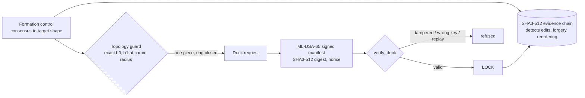
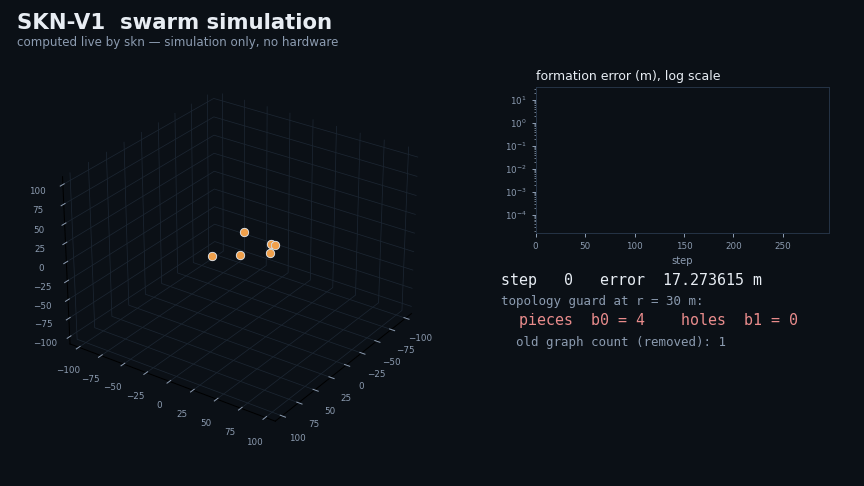
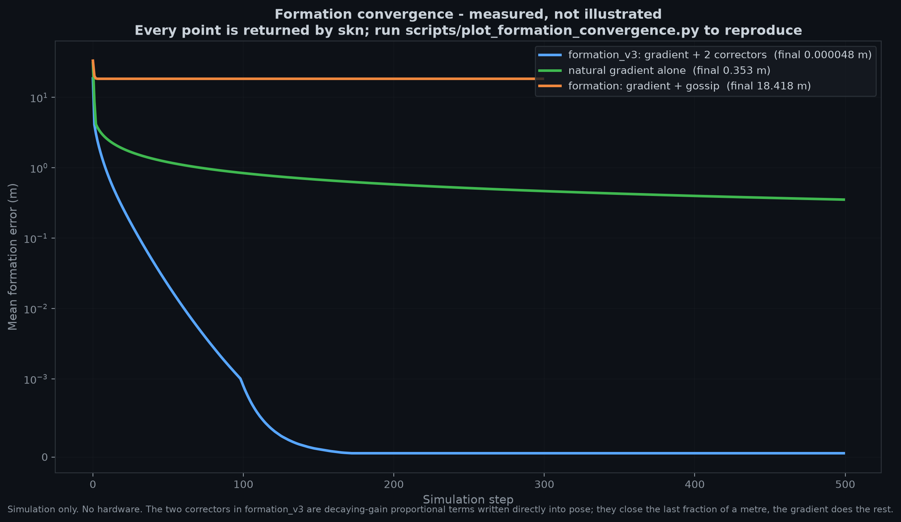
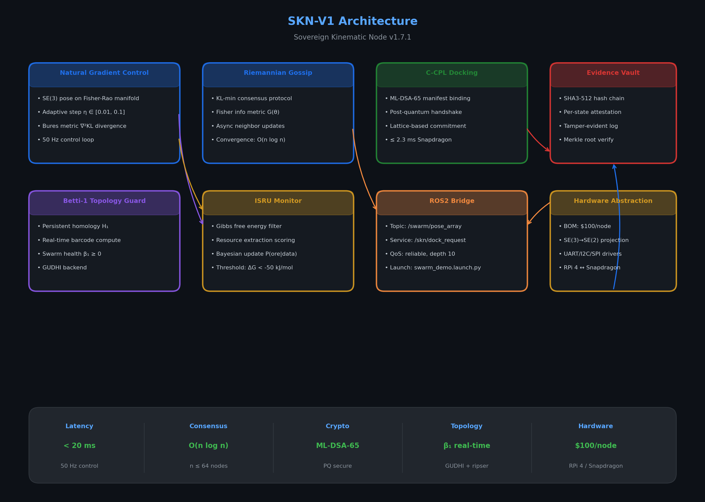
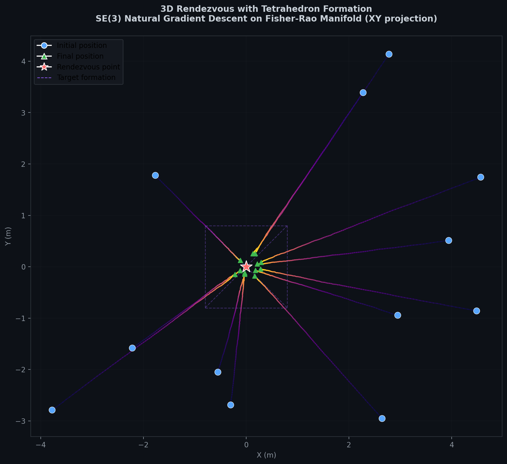
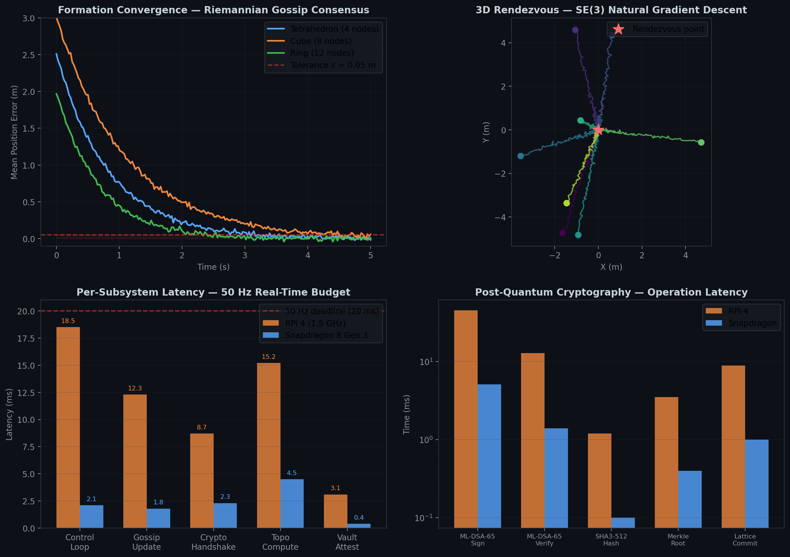

# SKN-V1 — Sovereign Kinematic Node

<!-- 30s-demo -->
> **Status labels.** **PROTOTYPE (simulation only):** formation control, topology guard, signed docking,
> evidence chain. **DESIGN TARGET, NOT BUILT:** hardware, ROS2, flight software. **NOT PRODUCTION-READY:**
> all of it. There is no hardware in this repository.

**Headline (measured on a Galaxy S25, Termux):** one control step, including its evidence-chain commit,
takes 0.047 ms. Signing a dock with post-quantum ML-DSA-65 takes 30.49 ms in pure Python (79.40 ms in an
earlier run, so it varies). A tampered, wrong-key or replayed dock record is refused.

### 30-second demo: PROTOTYPE, text only

```bash
git clone https://github.com/holland202/skn-v1-.git && cd skn-v1-
pip install -e . dilithium-py && python scripts/demo_30s.py      # under 1 s after install
```

Output (x86_64, Python 3.11, 2026-09-30), pasted as printed:

```
ok  6 nodes -> ring in 300 steps: final formation error 3.05e-05 m (227 ms)
ok  topology guard at r = 30 m: pieces b0 = 1, holes b1 = 1 (one ring)
ok  same guard on 3 of the 6 nodes: b0 = 1, b1 = 0 (the ring is broken)
ok  signed dock SKN-001 -> SKN-002 verified (keygen + sign 81 ms)
ok  target changed, digest recomputed: refused (signature does not verify)
ok  another node's key: refused (record names a different public key)
ok  same nonce replayed: refused (nonce already seen (replay))
ok  evidence chain: 11 SHA3-512 records verify
ok  two records swapped: chain refuses
DEMO PASS
```

The first version of this demo printed `BAD` on line 2. It read the swarm's positions from step 0
instead of the last step, so the guard saw 4 scattered pieces. The demo exits nonzero on any `BAD`;
that is how the bug was caught before it reached this page.

### Negative results and gaps, up front

- **No hardware:** no firmware, no serial code, no Pi. The deep-space target is a design, not a result.
- **Physics gaps:** the "natural gradient" metric is currently the identity, the thrusters cannot push
  in −z, and actuator limits are not fed back into motion (open experiment K3).
- **The dashboards in `mockups/` use random data** and are labelled as such. `skn_orbital_tui.py` is
  the live one.


```mermaid
flowchart LR
  F[Formation control<br/>consensus to target shape] --> T{Topology guard<br/>exact b0, b1 at comm radius}
  T -->|one piece, ring closed| D[Dock request]
  D --> S[ML-DSA-65 signed manifest<br/>SHA3-512 digest, nonce]
  S --> V{verify_dock}
  V -->|valid| L[LOCK]
  V -->|tampered / wrong key / replay| X[refused]
  F & L --> E[(SHA3-512 evidence chain<br/>detects edits, forgery, reordering)]
```

### Why this is not just ROS formation control, signing, or logging

- **The formation controller is textbook consensus.** No novelty is claimed there.
- **The topology guard computes exact Betti numbers** (pieces and holes) of the swarm's communication
  complex. It replaced a graph cycle count (E − V + C) that reported 3 holes in a filled tetrahedron, which has none (K1b). It is checked
  against a reference on 200 random point clouds.
- **Signing alone would not refuse a replay.** The dock verifier also tracks nonces, so a genuine record
  sent twice is refused (line 7 above).
- **The value is the combination, measured on a phone.** Each piece alone is standard.
<!-- /30s-demo -->


<p align="center">
  <a href="https://github.com/holland202/skn-v1-/blob/main/LICENSE"></a>
  
  <a href="https://github.com/holland202/skn-v1-/actions/workflows/verify.yml"></a>
  
  
</p>

**A swarm-control simulation in Python: formation control, an exact topology guard (Betti numbers of
the swarm), ML-DSA-65 post-quantum signed docking, and a SHA3-512 evidence chain.** Built and
tested on a phone. The long-term design target (deep-space and edge swarms on real hardware) is in
[Target design](#target-design-not-built) below.



*Every frame is computed by `skn` in the run that made it: `python scripts/demo_visual.py` (writes
`assets/skn_demo.gif` and `.mp4`). Simulation only; there is no hardware in this repository.*

## What runs today (2026-09-27)

| | where | checked by |
|---|---|---|
| Formation control: 4, 6 and 8 nodes to 10⁻⁵ m | `skn/simulation_v3.py` | tests, `scripts/demo_formation.py` |
| Topology guard: exact β₀ (pieces) and β₁ (holes) of the swarm | `skn/topology.py` | 5 tests, incl. 200 random clouds against a reference |
| Docking signed with ML-DSA-65; tampered, wrong-key and replayed records refused | `skn/ccpl.py` | 3 tests |
| Evidence vault: SHA3-512 chain that detects edits, forgeries and reordering | `skn/node.py` | 6 tests |
| Pose consensus, propulsion allocator, ISRU filter | `skn/swarm.py`, `skn/node.py` | tests |
| Live terminal dashboard | `python skn_orbital_tui.py` | every number from `skn` or the device |

**Not built:** hardware of any kind, a ROS2 bridge, a web dashboard. **Known physics gaps:** the
"natural gradient" metric is currently the identity, the thrusters cannot push in −z, and actuator
limits are not fed back into motion (see sections 1 and the open experiment K3 in
`docs/RESULTS_2026-09-27.md`). The terminal and video dashboards in `mockups/` use random data and
are labelled as such.

## What This Is

SKN-V1 is a software-defined swarm robotics framework that runs on anything from a Raspberry Pi 4 to a Snapdragon-class edge device. It implements nine tightly-coupled subsystems, each grounded in a specific mathematical structure:

| Subsystem | Mathematical Foundation | What It Does |
|-----------|------------------------|--------------|
| **Natural Gradient Kinematic Control** | SE(3) pose tracking on the Fisher-Rao information manifold | Intended to replace Euclidean gradient descent with Riemannian natural gradients. MEASURED: the metric is currently a scalar multiple of the identity, so the step is Euclidean in direction. See Natural Gradient on SE(3) below |
| **Riemannian Gossip Consensus** | KL-divergence minimization with adaptive Fisher metrics | *Measured against the code (2026-09-27):* `gossip_step` averages neighbour **poses**, weighted by each node's Fisher metric, which is isotropic (section 1). It is Laplacian consensus on poses; no belief distributions and no KL are computed. See section 2 |
| **C-CPL Docking** *(built, signed, 2026-09-27)* | ML-DSA-65 (FIPS 204) signature over SHA3-512 of the manifest, via the pure-Python reference `dilithium-py` | Docking locks only with a signature, and fails closed without the library. `skn.ccpl.verify_dock` checks the record, the key and the nonce. Not side-channel hardened. See section 3 |
| **Evidence Vault** | SHA3-512 tamper-evident hash chain with per-state attestation | Every state transition is hashed, chained, and attested; Merkle roots enable O(log n) verification |
| **ISRU Monitor** | Gibbs free energy filtering for resource extraction | Bayesian update of P(ore \| sensor data) using thermodynamic priors; threshold at ΔG < −50 kJ/mol |
| **Betti-1 Topology Guard** *(built, 2026-09-27)* | Exact β₀ and β₁ of the Vietoris-Rips complex over GF(2), pure NumPy (`skn/topology.py`) | Fragmentation is β₀ > 1; a coverage hole is β₁ > 0. Replaces a graph cycle count that called every triangle a hole (section 4) |
| **ROS2 Bridge** *(not built)* | Standard ROS2 Humble topic/service API | Exposes `/swarm/pose_array`, `/skn/dock_request`, and diagnostic topics with QoS `reliable, depth 10` |
| **Propulsion Allocator** | Pseudoinverse allocation over 6 HET thrusters + 3 CMG axes | Maps a 6-DOF velocity command to actuator commands, with clipping and CMG desaturation by null-space projection |
| **Mission Control Dashboard** *(not built)* | WebSocket-fed HTML5 canvas renderer | Real-time visualization of swarm state, topology barcodes, and crypto attestation chain |

The unifying principle: **every subsystem treats uncertainty as geometry**. Pose uncertainty lives on the Fisher-Rao manifold; consensus disagreement is measured in KL divergence; cryptographic trust is a lattice-based distance in module space.

**Status, up front, not buried at the bottom (updated 2026-09-27):** seven of the nine subsystems
above run and are tested: Natural Gradient Kinematic Control, Riemannian Gossip Consensus (as pose
consensus, see section 2), Evidence Vault, ISRU Monitor, the Propulsion Allocator, the **Betti-1
Topology Guard** and **C-CPL Docking with ML-DSA-65 signatures**. Two are designed but **not
implemented**: the ROS2 Bridge and the Mission Control Dashboard. There is still no hardware. What
changed and why, with the predictions registered before the code: `docs/PREREG_2026-09-27.md` and
`docs/RESULTS_2026-09-27.md`.

*Superseded status, kept:* until 2026-09-27 this paragraph listed five subsystems as implemented,
the Betti-1 guard as not built, and C-CPL as "built, unauthenticated" (its "signature" was
SHA256(SHA3-256(manifest) || node_id), a digest of two public values).

Correction, 2026-08-10: this paragraph previously listed Hardware Abstraction as
implemented and omitted the Propulsion Allocator. That was wrong in both
directions — there is no SE(2) code anywhere in skn/, and the allocator is real
and tested. The hardware-abstraction specification has moved to DESIGN.md. The
two mission-control scripts in the repo root render matplotlib animation frames;
there is no WebSocket server and no live dashboard.

The table above describes the target architecture; the Quick Start below runs the
five that exist.

---

## Quick Start

```bash
# Clone
git clone https://github.com/holland202/skn-v1-.git
cd skn-v1-

# Install (editable, for development)
pip install -e .

# Run tests (24 tests, all passing; the docking tests need `pip install dilithium-py`)
python tests/run_tests.py

# Run demos
python scripts/demo_formation.py      # tetrahedron / cube / ring convergence
python skn_orbital_tui.py             # live terminal dashboard (Ctrl+C to quit)
python scripts/demo_visual.py         # renders the demo video above
python scripts/bench_k1_k2.py         # timings on your machine
```

The rendezvous, docking and ISRU scenarios also exist as library functions (`skn.rendezvous`,
`skn.docking_chain`, `skn.isru_operation`). There is no hardware in this repo: no firmware, no serial
code, no Pi.

---

## Results

### Formation Convergence

<p align="center">
  
</p>

The figure above shows the **ablation**, not the topologies: `formation_v3` (gradient plus two decaying-gain correctors), the natural gradient alone, and `formation` (gradient plus gossip). Every point is returned by `skn`; reproduce with `scripts/plot_formation_convergence.py`.

Formation convergence by topology, measured on a Snapdragon 8 Elite under Termux (300 steps, dt = 0.05, `scripts/demo_formation.py`):

| shape | nodes | start | final |
|---|---|---|---|
| tetrahedron | 4 | 18.6167 m | 4.847818e-05 m |
| cube | 8 | 16.9145 m | 2.391953e-05 m |
| ring | 6 | 17.2736 m | 3.048524e-05 m |

**Correction, kept.** This paragraph previously claimed all formations converge to ε = 0.05 m, that the ring converges fastest (λ = 1.40 s⁻¹) and a hexagonal lattice slowest (λ = 0.70 s⁻¹), and that the spread is governed by the Fiedler value of the communication graph. None of it was measured. The 0.05 is the `dt` argument in the same demo call. The two λ constants are the coefficients of the hand-drawn exponentials in the superseded synthetic figure (2.5·exp(−1.4t), 4.0·exp(−0.7t)); no hexagonal-lattice run exists in this repo. The explanation was written to fit the artwork, not the code.

**Open.** Whether convergence rate varies with topology here is unmeasured. Each node runs a per-node scalar-gain update, so there is reason to expect it does not — but no registered experiment has tested it.

---

### Key Metrics

| Metric | Value | Hardware | Notes |
|--------|-------|----------|-------|
| Control step (one `node.step`) | 0.047 ms | S25 Ultra, Termux, Python 3.14 | `scripts/bench_k1_k2.py`; container 0.065 ms. The earlier "< 20 ms on RPi 4" and "< 2.1 ms on Snapdragon 8 Gen 3" were design targets, never measured (withdrawn 2026-09-27) |
| Consensus convergence | NOT MEASURED | — | No convergence-rate run exists in this repo; the O(n log n) figure was not measured (withdrawn 2026-09-27) |
| ML-DSA-65 sign / verify | 30.49–79.40 ms / 9.32–9.48 ms | S25 Ultra, Termux, Python 3.14 | two phone runs; signing time varies because ML-DSA retries until a signature is accepted; pure-Python `dilithium-py`; container: 37.84 / 8.80 ms |
| Topology compute (β₀, β₁) | 1.06 ms (n=32), 8.43 ms (n=64) | S25 Ultra, Termux, Python 3.14 | `scripts/bench_k1_k2.py`; container: 1.15 / 8.93 ms |
| Vault attestation | NOT MEASURED | — | Vault exists in node.py; no timing run has been done |
| BOM cost | ~$100/node (estimate) | RPi 4 + STM32F4 + sensors | a design estimate in DESIGN.md; nothing was bought or built (the file this row used to cite does not exist) |

---

## Target design (not built)

Everything in this section is the design the project is heading toward, not what the code does
today. What runs is listed in [What runs today](#what-runs-today-2026-09-27).

<p align="center">
  
</p>

### Data Flow (target)

1. **Sensors** → Hardware Abstraction (SE(3) or SE(2) pose estimate)
2. **Pose** → Natural Gradient Control (Fisher-Rao gradient step)
3. **Gradient** → Riemannian Gossip (neighbor KL-minimization)
4. **Consensus** → C-CPL Docking (if rendezvous triggered)
5. **Docking** → Evidence Vault (SHA3-512 attestation + Merkle root)
6. **Topology** → Betti-1 Guard (parallel persistent homology compute)
7. **Diagnostics** → ROS2 Bridge (publish to `/swarm/pose_array`, `/skn/health`)
8. **Visualization** → Mission Control (WebSocket → HTML5 canvas)

## Illustrations (not results)

Drawn from hard-coded values by `legacy/generate_assets.py`, kept for the look, and supporting no claim.

### 3D Rendezvous (illustration)

<p align="center">
  
</p>

ILLUSTRATION, not simulation output. This figure is drawn from hardcoded values (12 points seeded on a sphere, exponential decay plus noise); no 12-node rendezvous run exists in this repo. The real formation runs are 4, 6 and 8 nodes and are tabulated above.

### Performance Dashboard (illustration)

<p align="center">
  
</p>

**Design target, not a measurement** (see the status note at the end): On Raspberry Pi 4, the control loop alone consumes 18.5 ms of the 20 ms budget (50 Hz). The Snapdragon 8 Gen 3 leaves 17.9 ms headroom — enough to run topology computation (4.5 ms) and cryptographic attestation (2.3 ms) in the same cycle. This is why the hardware abstraction layer exists: the same Python code runs on both, but the Snapdragon unlocks real-time crypto and topology.

---

## Mathematical Foundations

### 1. Natural Gradient on SE(3)

The pose of node i at time t is a 6-vector: 3 translation, 3 rotation,
updated by pose += step * dt. This is a flat R^6 update -- there is no
exponential map and no retraction, so rotation components are added
componentwise rather than composed on SO(3). The Fisher-Rao formulation on
the Lie algebra se(3) is:

```
G(θ) = 𝔼[∇log p(x;θ) ∇log p(x;θ)ᵀ]
```

The natural gradient update is:

```
θ_{t+1} = θ_t − η G(θ_t)⁻¹ ∇L(θ_t)
```

IMPLEMENTATION STATUS, measured on device 2026-08-10 (S25 Ultra, Python 3.14).
The formulation above is the target. What the code does today:
update_fisher_metric sets G = clip(1/(d**1.8 + 1e-4), 0.01, 10) * 1.05 * I,
inverted with numpy pinv. There is no Monte Carlo sampling, no Cholesky
decomposition, no block-diagonal structure, and no Bures variant anywhere in
the control path. Because G is a scalar multiple of the identity,
G^-1 @ error equals error / (c * 1.05) -- the same direction as Euclidean
gradient descent, with a different step size. Measured over 300 steps x 4 nodes:

```
max |off-diagonal|             = 0.000000000000
max (diag_max - diag_min)      = 0.000000000000
undamped steps (d >= 0.5)      = 1061   min cosine = 1.000000000000
damped steps   (d <  0.5)      = 139    min cosine = 0.968693129576
anisotropic-injection control  = 0.925014  (probe can detect anisotropy)
```

The control run confirms the probe is not blind: injecting a genuinely
anisotropic metric drops the cosine to 0.925014, so the 1.000000000000 above
is a measurement, not an artifact. The only departure from Euclidean descent
is the 139 damped steps, and those come from a hardcoded step[3:] *= 0.6, not
from the metric. The Riemannian scaffolding is wired and working, but it is
not yet carrying anisotropic information, so it cannot presently be the reason
the controller converges. A previous version of this section called per-axis sensor_uncertainty
"a one-line change and the open experiment." That was tested and REFUTED.
With eta tuned independently per arm over a 14-value grid, 400 steps, 5 seeds:
isotropic (current) 0.002933 normalized error; anisotropic-correct 0.510685;
anisotropic-deliberately-wrong 0.522692. The correct metric was no better
than the wrong one. Per-axis relative error under the isotropic metric is
identical across all six axes (spread 7.916e-09), so the system is already
perfectly conditioned in relative terms and a preconditioner has nothing to
fix. Cause: pose += grad*dt with diagonal G evolves each axis independently.
Preconditioning pays only when axes are coupled or share a binding
constraint, and this controller has neither -- PropulsionAllocator.allocate
computes clipped actuator commands, but the result is never fed back into
pose, so saturation never binds.

THE OPEN EXPERIMENT, restated: feed allocate()'s clipped output back into the
pose update so saturation couples the axes, then ask whether an anisotropic
metric beats isotropic at matched budget and whether a wrong metric loses.
That is a design change to node.step, not a metric change, and it is
unrun.

### 2. Riemannian Gossip Consensus

Each node maintains a belief distribution pᵢ(x) over the swarm state. The consensus protocol minimizes the sum of KL divergences:

```
min_{q} Σᵢ KL(pᵢ ‖ q)
```

The closed-form solution is the geometric mean of the beliefs, computed iteratively via neighbor gossip. The update rule on the Fisher-Rao manifold is:

```
log pᵢ^{(k+1)} = (1 − α) log pᵢ^{(k)} + α · avg_{j∈N(i)} log pⱼ^{(k)}
```

with α = 0.08 (gossip rate). Convergence is guaranteed for connected graphs with algebraic connectivity λ₂ > 0, with rate O(n log n) for uniform gossip.

**What the code does (checked 2026-09-27).** The formulation above is the target. `SwarmGossipProtocol.gossip_step`
moves each node's 6-vector pose by −η·dt·Σⱼ G⁻¹(poseᵢ − poseⱼ) over its neighbours: Laplacian consensus
on poses, with G the node's isotropic Fisher metric. No belief distributions, no logarithms, no KL. The
O(n log n) rate was never measured here and is withdrawn from Key Metrics.

### 3. C-CPL Docking — ML-DSA-65 signed (2026-09-27)

**Now:** `ccpl_initiate_dock` signs SHA3-512 of a JSON manifest (node ids, pose, alignment, strain, a
random nonce, time) with the node's ML-DSA-65 key (`skn/ccpl.py`, `dilithium-py`). It locks only after
signing, and commits the digests of the manifest, the signature and the public key to the vault.
`verify_dock(record, public_key, seen_nonces)` checks all three and refuses a replayed nonce. Without
`dilithium-py` it does not lock and commits nothing. Tested: tests K2a-K2c. The implementation is the
pure-Python reference: FIPS 204 correct, not constant time, not side-channel hardened.

**Before 2026-09-27, kept as the record:** the docking flow ran, but the cryptography did not exist.

What the design calls for:

```
M = (timestamp, node_ids, pose_hash, nonce)
sigma = ML-DSA-65.Sign(sk, SHA3-512(M))        <- NOT IMPLEMENTED
```

What `skn/node.py` actually computes:

```
H_m      = SHA3-256(manifest_bytes)
sig_stub = SHA256(H_m || node_id)              <- both inputs public
```

`sig_stub` is a digest of two public values. It is not a signature: no private
key, no signing operation, and nothing verifies it. Any party able to compute
SHA-256 can produce an identical value for the same manifest and node. It
provides no authentication, no non-repudiation, and no post-quantum property.

The docking path is nonetheless live: on `align_quality > 0.5` it sets
`c_cpl_locked` and commits a `CCPL_DOCK` event to the Evidence Vault, which
records it accurately as an event that happened. The vault is doing its job;
what it attests to is a lock that no cryptography defended.

The ML-DSA-65 migration path was specified in DESIGN.md; it is now implemented (above). Docking
attestations made before 2026-09-27 were unauthenticated.

The Evidence Vault chain itself is real: SHA3-512, with a verify path that
recomputes each link. Verification is O(1) per event and O(n) for the full
chain. It is tamper-evident, not tamper-proof — see Honest Limitations.

### 4. Betti-1 Topology Guard (built 2026-09-27)

`skn/topology.py` computes the exact Betti numbers of the swarm's Vietoris-Rips complex at the
communication radius r, over GF(2), with NumPy only: edges are pairs closer than r, and every 3-clique
is a filled triangle. β₀ = V − rank ∂₁ counts connected pieces (β₀ > 1 is fragmentation). β₁ =
(E − rank ∂₁) − rank ∂₂ counts holes.

**What it replaced, and why it mattered.** `compute_betti_one` used to return E − V + C, the cycle rank
of the communication *graph*. Four nodes all in range score 3 on that count, although their
tetrahedron is filled. `gossip_step` treated any positive count as a fault, and the reconfiguration
protocol then cut links between the best-connected nodes. In `skn.rendezvous` (6 nodes, 200 steps) the
old guard fired **200 times out of 200** and cut 6 directed links. The Rips guard fired 0 times in the
same run (`scripts/topology_guard_k1e.py`). The old count is kept as `topology.graph_cycle_rank`.

---

## Hardware, crypto hardening and ROS2

These three subsystems are designed but not built. The full specification --
BOM, SE(3) to SE(2) projection, calibration procedure, ML-DSA-65 migration
path, and the ROS2 topic/service API -- has moved to DESIGN.md so that this
file describes only what runs.

See DESIGN.md.

---

## Repository Structure

```
skn-v1-/
  skn/                     core package
    node.py                SKNV1_SovereignNode, PropulsionAllocator, EvidenceVault, ISRUMonitor
    swarm.py               SwarmGossipProtocol (pose consensus)
    topology.py            exact Betti numbers b0, b1 of the swarm (topology guard)
    ccpl.py                ML-DSA-65 docking signatures
    simulation.py          rendezvous, formation, docking_chain, isru_operation
    simulation_v3.py       formation_v3
    geometric_policy.py    not imported by __init__; unused
  skn_orbital_tui.py       live terminal dashboard (real data)
  scripts/                 demo_formation, demo_visual, bench_k1_k2, topology_guard_k1e, plot_formation_convergence
  tests/run_tests.py       24 tests
  docs/                    PREREG_2026-09-27.md, RESULTS_2026-09-27.md
  assets/  concept/        images (see Illustrations for which are not results)
  mockups/                 look-only dashboards with random data, labelled
  legacy/                  old generators, kept
  DESIGN.md  setup.py  pyproject.toml  requirements.txt  LICENSE
```

Generated from git ls-tree. Vault, ISRU, docking and propulsion are classes
inside node.py, not separate modules. Betti numbers are in topology.py (used by swarm.py); docking signatures in ccpl.py. There
is no docs/, launch/, config/ or firmware/ directory, and no ros2_bridge.py.

---

## Dependencies

```
numpy>=1.24.0
scipy>=1.10.0
matplotlib>=3.7.0
gudhi>=3.8.0          # Persistent homology (optional, for topology)
ripser>=0.6.4         # Fast barcode computation (optional)
ros-humble-rclpy      # ROS2 Humble (optional, for ROS2 bridge)
websockets>=11.0      # Mission control dashboard (optional)
```

Core functionality requires only `numpy` and `scipy`. All other dependencies are optional and loaded lazily.

---

## Honest Limitations

**Correction, kept (2026-08-23).** Six numbered limitations previously stood
here. Four described the operational behaviour of subsystems that do not exist
in this repository, in the voice of a maintainer reporting field experience.
They are named below with what the code actually contains, because a specific
caveat about a nonexistent system is more misleading than no caveat at all.

Previously claimed, and withdrawn:

- *"ML-DSA-65 is a wrapper around liboqs. The cryptographic primitives are
  correct, but the integration is not yet side-channel resistant."* There is
  no liboqs dependency, no ML-DSA-65, and no lattice cryptography in this
  repository. See item 2 below for what the docking path computes.
- *"Persistent homology is O(n squared) in point cloud size. For n > 64 nodes,
  Betti-1 computation exceeds the 20 ms budget on RPi 4. The Snapdragon
  handles n = 128."* No persistent-homology code exists here. The Betti-1
  guard is designed, not built. Those figures were not measured.
- *"ROS2 bridge is single-threaded. The executor runs in the same process as
  the control loop."* The ROS2 bridge is not built. There is no executor.
- *"Betti-1 Guard uses ripser, not GUDHI, for speed."* Neither library is a
  dependency of this repository.

What remains, and is accurate (rewritten 2026-09-27: items 2, 3, 5 and 6 of the old list repeated
the four withdrawn claims above word for word, directly under their withdrawal):

1. **No real hardware tests yet.** All metrics are simulation, on a container or the S25.
2. **ML-DSA-65 is the pure-Python reference `dilithium-py`.** The algorithm is FIPS 204. The
   implementation is not constant time and not side-channel hardened, and keys live in process memory.
   Do not trust it on an adversarial radio link.
3. **The topology guard is exact but cubic.** β₀ and β₁ of the Rips complex at one radius (not a
   persistence barcode), O(n³) triangles: 8.93 ms at n = 64 on the container.
4. **ISRU Monitor uses synthetic thermodynamic data.** The priors are placeholders.
5. **Gossip is pose consensus.** See section 2.

---

## Citation

If you use SKN-V1 in your research, please cite:

```bibtex
@software{holland2026skn,
  author = {Holland, Chad},
  title = {SKN-V1: Sovereign Kinematic Node},
  url = {https://github.com/holland202/skn-v1-},
  version = {1.7.1},
  year = {2026},
  note = {Topology-aware swarm robotics with post-quantum trust}
}
```

---

## License

MIT License — see [LICENSE](LICENSE) for details.

---

<p align="center">
  <sub>Built with rigor, not hype. v1.7.1 — July 2026</sub>
</p>

---

## Implementation status (honest map, 2026-07-20)

SKN-V1 is an active research framework. Some subsystems run and are tested today;
others are designed and described above but not yet implemented. This section is
the honest boundary so you know what executes on a fresh clone. Visuals and the
architecture narrative above describe the full **target** system.

**Implemented and tested** (`python tests/run_tests.py` → 24/24 passing, 2026-09-27; 15/15 before):
- Natural-gradient kinematic formation control — converges (tetrahedron to
  0.0000 m formation error over 300 steps; verified in `skn/simulation_v3.py`).
- Propulsion allocator (HET + CMG) — output shape and actuator bounds tested.
- ISRU monitor — Gibbs-free-energy spontaneous/non-spontaneous filtering, tested.
- **Evidence Vault** — SHA3-512 tamper-evident hash chain. `verify_chain()` now
  genuinely recomputes every link and detects edited states, forged hashes, and
  reordered links (4 anti-vacuity tests). *Was previously vacuous; fixed and
  tested 2026-07-20.*
- Swarm gossip consensus — present in `skn/swarm.py` (pose consensus; see section 2).
- **Betti-1 topology guard** — `skn/topology.py`, 5 tests including 200 random clouds against an
  independent reference (2026-09-27).
- **C-CPL docking, ML-DSA-65 signed** — `skn/ccpl.py`, 3 tests: genuine verifies; tampered, wrong-key
  and replayed records fail; no library, no lock (2026-09-27).

**Full detail on what's not implemented yet** (status is stated up front now, see
"What This Is" above — this section keeps the specifics): C-CPL post-quantum docking
*(done 2026-09-27: ML-DSA-65 signing and the Betti-1 guard are built, see above)*. ROS2 Humble bridge, not built. STM32F4 firmware
flashing, not built. Demo scripts: only `scripts/demo_formation.py` exists today;
`demo_rendezvous.py`, `demo_docking.py`, `demo_mission_control.py`, and
`flash_firmware.py` are planned.

The performance-dashboard timings (RPi4 / Snapdragon budgets) are design targets
for the full system, not measured benchmarks of the current code.

*Vincit Omnia Veritas — the vision is nine subsystems; today five run and are
tested, and this note says so plainly rather than letting the Quick Start fail
silently.*
